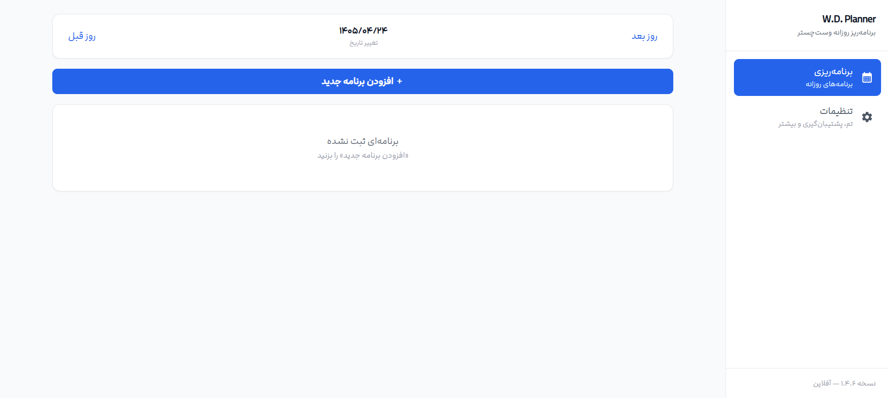
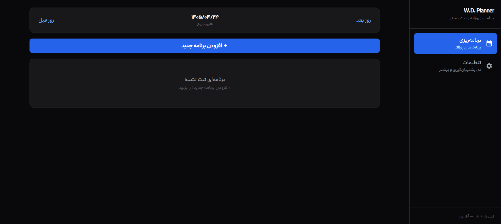
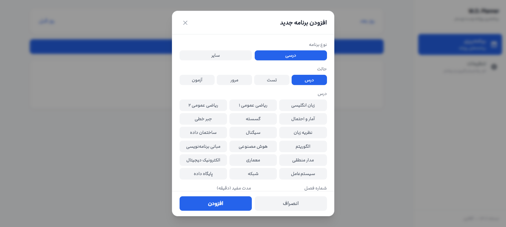
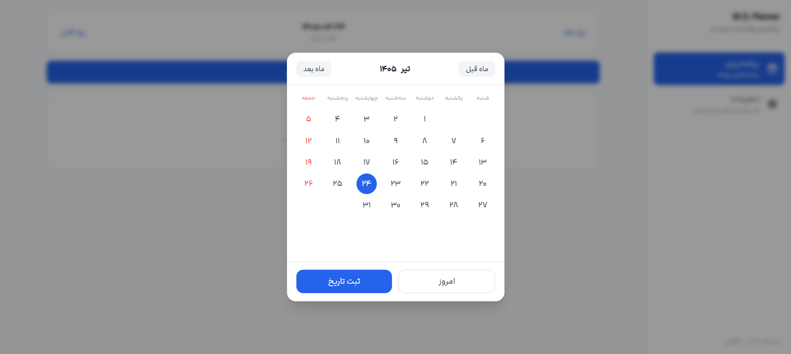
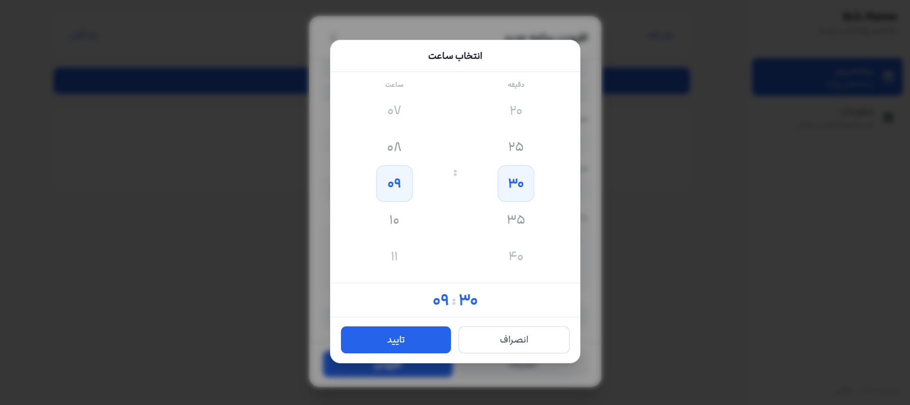
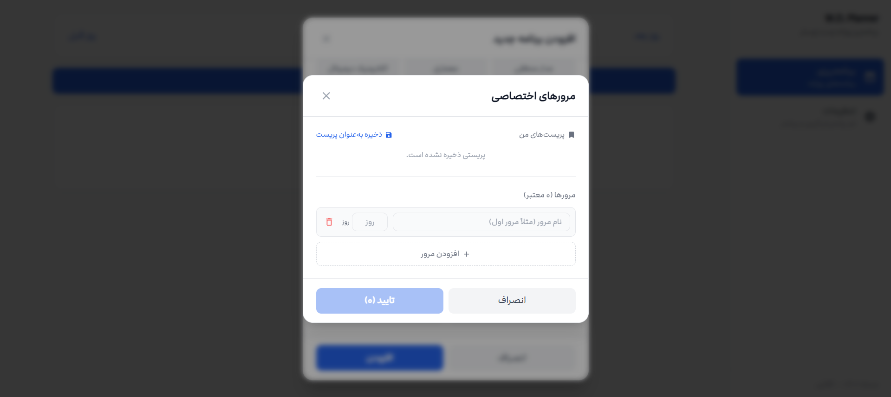

# W.D. Planner — برنامه‌ریز روزانه وست‌چستر

> یک برنامه‌ریز روزانه آفلاین، مینیمال و حرفه‌ای برای دانشجویان و دانش‌آموزان — با پشتیبانی از تقویم شمسی، مرورهای خودکار، و مرورهای اختصاصی.

<p align="center">
  <a href="#نصب">نصب</a> •
  <a href="#ویژگی‌ها">ویژگی‌ها</a> •
  <a href="#اسکرین‌شات‌ها">اسکرین‌شات‌ها</a> •
  <a href="#انتقال-به-گیت‌هاب">انتقال به گیت‌هاب</a> •
  <a href="#تکنولوژی‌ها">تکنولوژی‌ها</a>
</p>

---

## معرفی

پروژه **W.D. Planner** یک برنامه‌ریز روزانه‌ی سبک و آفلاین است که کاملاً در مرورگر اجرا می‌شود و داده‌ها به‌صورت محلی (IndexedDB) ذخیره می‌شوند — هیچ سرور یا حساب کاربری لازم نیست.

این پروژه با تمرکز بر **طراحی مینیمال، تمیز و حرفه‌ای** ساخته شده و از تقویم شمسی (Jalali) به‌عنوان تقویم اصلی استفاده می‌کند.

---

## ویژگی‌ها

### 📅 برنامه‌ریزی روزانه
- افزودن برنامه‌های درسی و سایر فعالیت‌ها
- انتخاب نوع (درسی/سایر)، حالت (درس/تست/مرور/آزمون)، درس و شماره فصل
- زمان‌بندی شروع و پایان با تایم‌پیکر سفارشی
- ثبت مدت مفید (دقیقه)
- یادداشت‌گذاری برای هر برنامه
- تیک زدن برنامه‌های انجام‌شده

### 🔁 سیستم مرور هوشمند
- **مرور پیش‌فرض:** ۵ مرور خودکار با بازه‌های علمی (۱، ۳، ۱۰، ۳۵، ۹۰ روز بعد)
- **مرور اختصاصی:** ساخت مرورهای دلخواه با نام و فاصله‌ی زمانی شخصی
- **پریست‌های ذخیره‌شده:** ذخیره‌ی الگوهای مرور برای استفاده‌ی مجدد
- نمایش badge مرور روی هر برنامه
- یادداشت‌گذاری مستقل برای هر مرور

### 🌗 پشتیبانی کامل از تم تاریک
- تغییر آنی بین تم روشن و تاریک
- ذخیره‌ی تنظیمات تم در localStorage
- طراحی هماهنگ برای هر دو حالت

### 📆 تقویم شمسی (Jalali)
- انتخابگر تاریخ شمسی سفارشی
- ناوبری بین روزها با دکمه‌های «روز قبل» و «روز بعد»
- پشتیبانی از swipe روی موبایل

### ⏰ تایم‌پیکر سفارشی
- چرخ‌های اسکرولی برای ساعت و دقیقه
- پشتیبانی از wheel موس، درگ (ماوس + لمس)، و ترک‌پد
- لوپ بی‌نهایت (۲۳ → ۰۰ و ۵۵ → ۰۰)
- گام ۵ دقیقه‌ای برای دقیقه‌ها

### 💾 پشتیبان‌گیری و بازیابی
- خروجی‌گیری از تمام برنامه‌ها به فایل JSON
- وارد کردن نسخه پشتیبان
- پاک‌سازی کامل اطلاعات

### 🎨 طراحی مینیمال و حرفه‌ای
- سطوح جامد و تمیز (بدون افکت‌های زائد)
- پالت رنگی محدود و هماهنگ
- انیمیشن‌های ظریف و روان
- کاملاً واکنش‌گرا (موبایل + دسکتاپ)
- سایدبار در دسکتاپ، نوار پایین در موبایل

### ♿ بهینه‌سازی تجربه کاربری
- پشتیبانی از wheel موس روی فیلدهای عددی
- پشتیبانی از arrow keys کیبورد
- اعداد فارسی در همه‌جا
- پاپ‌آپ‌های اعلان با نوار پیشرفت
- حذف اسکرول‌بار (اسکرول همچنان کار می‌کند)

---

## اسکرین‌شات‌ها

### حالت روشن (Light Mode)

<p align="center">
  
</p>

### حالت تاریک (Dark Mode)

<p align="center">
  
</p>

### افزودن برنامه جدید

<p align="center">
  
</p>

### تقویم شمسی

<p align="center">
  
</p>

### تایم‌پیکر سفارشی

<p align="center">
  
</p>

### مرورهای اختصاصی

<p align="center">
  
</p>

---

## نصب

### پیش‌نیازها
- [Node.js](https://nodejs.org/) نسخه‌ی ۱۸ یا بالاتر
- npm یا yarn

### مراحل نصب

```bash
# کلون کردن پروژه
git clone https://github.com/W3stchester/WDP.git
cd wd-planner

# نصب وابستگی‌ها
npm install

# اجرای نسخه‌ی توسعه
npm run dev
```

سپس مرورگر را روی `http://localhost:3000` باز کنید.

### build تولیدی

```bash
# ساخت نسخه‌ی تولیدی
npm run build

# پیش‌نمایش نسخه‌ی تولیدی
npm run preview
```

فایل‌های تولیدی در پوشه‌ی `dist/` قرار می‌گیرند و می‌توانند روی هر static host مستقر شوند.

---

## تکنولوژی‌ها

| تکنولوژی | کاربرد |
|----------|--------|
| **React 18** | چارچوب UI |
| **Vite 5** | ابزار build و dev server |
| **Tailwind CSS 3** | استایل‌دهی |
| **Dexie.js** | wrapper IndexedDB برای ذخیره‌سازی محلی |
| **dayjs + jalaliday** | کار با تاریخ شمسی |
| **jalaali-js** | تبدیل تاریخ میلادی ↔ شمسی |
| **react-icons** | آیکن‌ها |

---

## ساختار پروژه

```
wd-planner/
├── src/
│   ├── components/
│   │   ├── BottomNav.jsx          # سایدبار + نوار موبایل
│   │   ├── Common/
│   │   │   ├── ConfirmModal.jsx   # مودال تأیید
│   │   │   └── Toast.jsx          # پاپ‌آپ اعلان‌ها
│   │   ├── Planning/
│   │   │   ├── DailyForm.jsx      # فرم افزودن/ویرایش برنامه
│   │   │   ├── DailyItem.jsx      # کارت برنامه
│   │   │   ├── DailyList.jsx      # لیست برنامه‌ها
│   │   │   ├── DailyPlanning.jsx  # صفحه برنامه‌ریزی روزانه
│   │   │   ├── CustomReviewModal.jsx # مودال مرورهای اختصاصی
│   │   │   └── PlanningPage.jsx   # کانتینر صفحه برنامه‌ریزی
│   │   └── Settings/
│   │       └── SettingsPage.jsx   # صفحه تنظیمات
│   ├── context/
│   │   ├── ThemeContext.jsx       # مدیریت تم
│   │   └── SettingsContext.jsx    # مدیریت تنظیمات
│   ├── utils/
│   │   ├── dateUtils.js           # توابع تاریخ شمسی
│   │   ├── timeUtils.js           # توابع زمان + اعداد فارسی
│   │   ├── reviewGenerator.js     # منطق تولید مرورها
│   │   ├── JalaliDatePicker.jsx   # تقویم شمسی
│   │   ├── TimePicker.jsx         # تایم‌پیکر سفارشی
│   │   └── WheelNumberInput.jsx   # اینپوت عددی با wheel
│   ├── App.jsx                    # کامپوننت ریشه
│   ├── main.jsx                   # نقطه ورود
│   ├── index.css                  # استایل‌های سراسری + سیستم طراحی
│   ├── db.js                      # تعریف IndexedDB
│   └── constants.js               # لیست دروس + بازه‌های مرور
├── public/                        # فایل‌های استاتیک
├── index.html                     # HTML ریشه
├── package.json
├── vite.config.js
└── tailwind.config.js
```

---

## منطق مرورها

### مرور پیش‌فرض
وقتی یک درس جدید با حالت «درس» اضافه می‌شود، ۵ مرور خودکار با بازه‌های زیر ایجاد می‌شود:

| مرور | روز بعد | نوع |
|------|---------|-----|
| مرور درسنامه | ۱ روز | مرور |
| تست‌های فرد | ۳ روز | تست |
| تست‌های زوج | ۱۰ روز | تست |
| مرور اول | ۳۵ روز | تست |
| مرور دوم | ۹۰ روز | تست |

### مرور اختصاصی
کاربر می‌تواند مرورهای دلخواه با نام و فاصله‌ی زمانی شخصی بسازد. این مرورها به‌صورت badge روی برنامه‌های مربوطه نمایش داده می‌شوند.

### حذف آبشاری
- حذف یک **درس پایه** → تمام مرورهای مشتق‌شده حذف می‌شوند
- حذف یک **مرور** → فقط همان مرور حذف می‌شود (درس پایه و سایر مرورها دست‌نخورده می‌مانند)

---

## میانبرهای کیبورد

- `Esc` — بستن مودال‌های باز
- `Arrow Up/Down` — تغییر مقدار فیلدهای عددی (فصل، مدت مفید، روز مرور)
- `Wheel موس` — تغییر مقدار فیلدهای عددی (وقتی فوکوس هستند)

---

## انتشار آنلاین

این پروژه یک اپلیکیشن آفلاین است و می‌توانید آن را روی هر static host مستقر کنید:

### GitHub Pages
```bash
npm run build
# فایل‌های dist/ را روی GitHub Pages قرار دهید
```

### Vercel / Netlify
1. ریپو را به Vercel/Netlify متصل کنید
2. Build command: `npm run build`
3. Output directory: `dist`

---

## نسخه‌ها

### v1.4.6 (نسخه فعلی)
- سیستم Toast برای اعلان‌های خطا با نوار پیشرفت
- پشتیبانی از arrow keys در فیلدهای عددی
- بهبود تایم‌پیکر با درگ ماوس/لمس

### v1.4.5
- بازنویسی حرفه‌ای تمام متن‌ها
- اصلاح باگ cascade edit در مرورهای اختصاصی
- پاک‌سازی کد و حذف dead code
- نمایش badge مرور روی کارت‌ها

### v1.4.0
- بازطراحی کامل با استایل مینیمال و حرفه‌ای
- سیستم طراحی surface-based
- پشتیبانی کامل از تم تاریک

[تاریخچه کامل تغییرات](CHANGELOG.md)

---

## مجوز

این پروژه تحت مجوز **MIT** منتشر شده است. برای جزئیات بیشتر فایل [LICENSE](LICENSE) را ببینید.

---

## توسعه‌دهنده

**Westchester** — [Westchester.ir](https://Westchester.ir)

---

<p align="center">
  ساخته‌شده با ❤️ برای دانش‌آموزان و دانشجویان فارسی‌زبان
</p>
